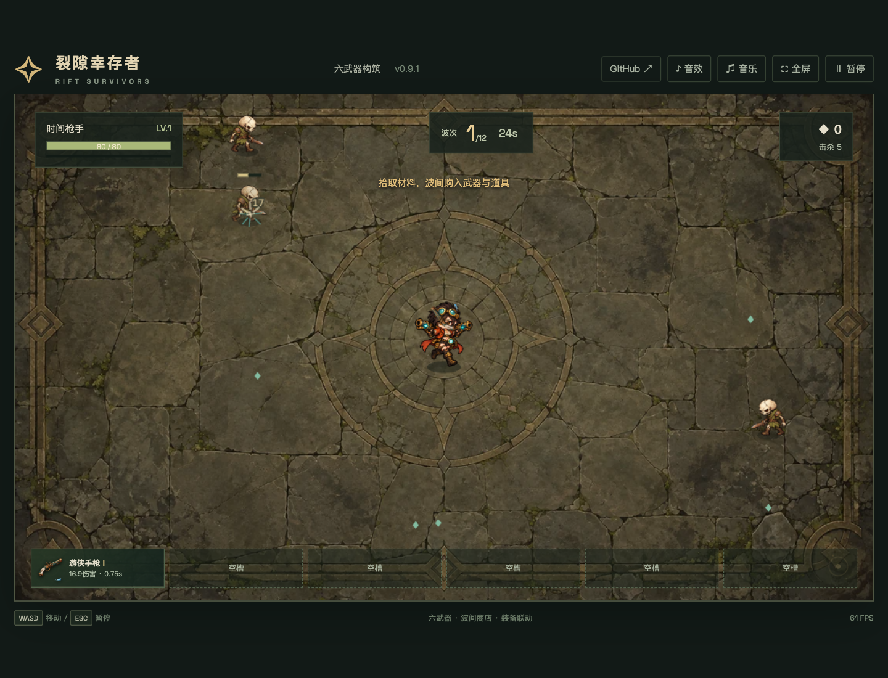

# 裂隙幸存者 · Rift Survivors

在怪潮之间购买、合成与搭配武器和道具，构筑自己的生存竞技场打法。

A browser survival arena with independent weapons, contact melee and between-wave shops.

[在线体验](https://rift-survivors.xiaosang.cc/) · [源码](https://github.com/holynova/rift-survivors)



## 可以做什么

- 武器独立攻击，近战按真实轨迹接触命中。
- 波间购买、锁定、出售、合成与刷新商店。

## 怎么玩

WASD / 方向键移动，Esc暂停；武器自动攻击，波间进入商店。

## 本地运行

```bash
npm ci
npm run dev
# 生成生产产物
npm run build
```

[设计文档](docs/INDEX.md) · [资源图鉴与音乐试听](https://rift-survivors.xiaosang.cc/build-gallery.html) · [版本历史](docs/production/version-history.md)

桌面键盘为主要输入方式。切换标签页自动暂停。


## 发布

```bash
npm run deploy
```

从 `main` 同一提交在本地手动发布到Cloudflare Workers。正式地址：[https://rift-survivors.xiaosang.cc/](https://rift-survivors.xiaosang.cc/)。
