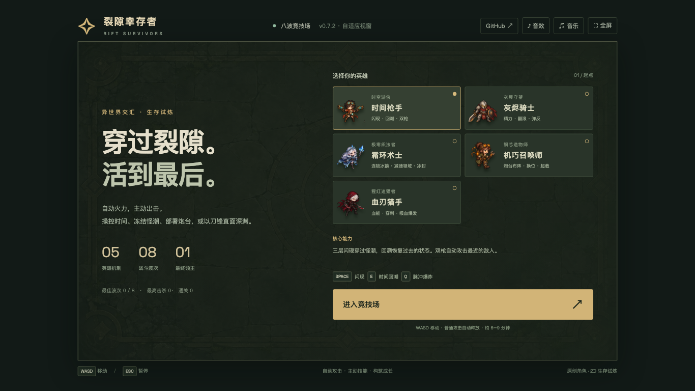

# 裂隙幸存者 / Rift Survivors

中文：五名原创英雄，在八波怪潮中生存。自动攻击，主动释放位移、技能与终极技；通过升级、商店和遗物组合构筑，挑战精英与最终领主。包含角色动画、分层特效、采样音效及战斗音乐；根据浏览器窗口自动缩放，首屏完整展示。桌面键鼠操作，无需账号。

English: A browser survival arena with five original heroes and eight enemy waves. Combine automatic attacks with active movement, skills, upgrades and relics to face elites and the final boss. Animated characters, layered effects, sampled combat audio and music; the interface fits the browser viewport. Desktop keyboard and mouse required; no account needed.



## 在线体验 / Live Demo

- [Cloudflare Demo](https://rift-survivors.xiaosang.cc/)
- [GitHub Repo](https://github.com/holynova/rift-survivors)


## 操作 / Controls

WASD / 方向键移动，Space 核心动作，E 技能，Q 终极技，Esc 暂停。普通攻击自动释放；切换标签页自动暂停。

WASD / arrow keys: move; Space: core action; E: skill; Q: ultimate; Esc: pause. Attacks are automatic. Switching tabs pauses the game.

## 本地运行 / Run locally

```bash
npm ci
npm run dev -- --host 127.0.0.1 --port 5188 --strictPort
npm test
npm run test:browser
npm run build
npm run preview
```

## 发布 / Deploy

```bash
npm run deploy
```

Cloudflare Workers · Custom Domain: `rift-survivors.xiaosang.cc`.
源码与发布配置使用单一主分支，本地手动部署。Source and deployment configuration share one primary branch; deploy manually from the same commit.

[设计文档 / Design docs](docs/INDEX.md) · [试玩记录 / Playtest log](docs/production/playtest-log.md) · [版本历史 / History](docs/production/version-history.md) · [音效授权 / Audio credits](docs/art/audio-manifest-v7.json)
